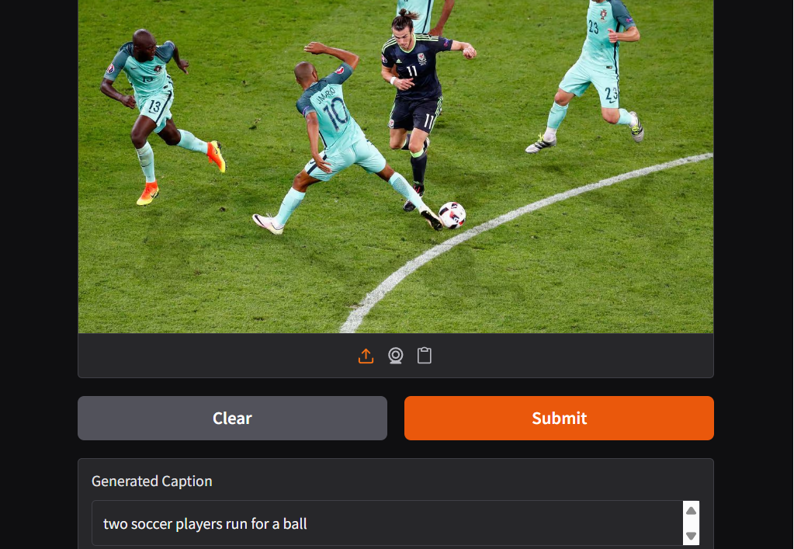

# Image Captioning with CNN + LSTM

A deep learning system that generates natural language captions for images, built using a CNN encoder (ResNet50) and an LSTM decoder, trained from scratch on the Flickr8k dataset.

## Demo

Upload any image and the model generates a descriptive caption in real time via a Gradio web interface.



## Overview

This project implements an encoder-decoder architecture for automatic image captioning:

- **Encoder (CNN):** A pretrained ResNet50 (ImageNet weights, frozen) extracts a 2048-dimensional feature vector summarizing the visual content of an image.
- **Decoder (LSTM):** A custom LSTM network takes the image feature vector as its initial hidden state and generates a caption word-by-word, conditioned on the words generated so far.

This is the classic "Show and Tell" style architecture — a strong baseline for image captioning, without an attention mechanism.

## Architecture

```
Input Image (224x224x3)
        |
   ResNet50 (frozen, pretrained on ImageNet)
        |
   2048-dim feature vector
        |
   Linear projection -> LSTM initial hidden state
        |
   LSTM decoder (word embedding -> LSTM -> vocabulary softmax)
        |
   Generated caption, word by word
```

**Model details:**
- Embedding dimension: 256
- LSTM hidden dimension: 512
- Vocabulary size: 2,988 words (frequency threshold: min 5 occurrences)
- Total trainable parameters: ~4.9M
- Max caption length: 35 tokens

## Dataset

**Flickr8k** — 8,091 images, each paired with 5 human-written reference captions (40,455 total captions).

| Split | Images | Captions |
|---|---|---|
| Train | 6,877 (85%) | 34,385 |
| Validation | 809 (10%) | 4,045 |
| Test | 405 (5%) | 2,025 |

Split performed at the image level (not caption level) to prevent data leakage between sets.

## Preprocessing

- Captions lowercased, punctuation and numbers stripped
- `startseq` / `endseq` tokens added to mark caption boundaries
- Vocabulary built from words occurring at least 5 times (reduces 8,780 raw unique words to 2,988)
- `<pad>` and `<unk>` special tokens included
- Images resized to 224x224 and normalized using ImageNet mean/std statistics
- CNN features extracted once and cached to disk (avoids re-running the CNN forward pass every training epoch)

## Training

- Loss: Cross-entropy (padding tokens ignored)
- Optimizer: Adam, learning rate 1e-3
- Batch size: 32
- Epochs: 15
- Teacher forcing used during training (ground-truth previous word fed at each timestep)
- Best model checkpoint selected by lowest validation loss

**Results:**
- Best validation loss: **2.81**
- BLEU score (averaged over 200 random test images): **0.169**

## Example Outputs

| Image | Generated Caption | Reference Caption |
|---|---|---|
| *(sample 1)* | "a boy wearing a blue shirt is playing with a red bat" | "A boy wearing a red t-shirt is running through woodland." |
| *(sample 2)* | "a young boy wearing a red shirt is playing tennis" | "A girl is about to hit a tennis ball coming from above her with a racket." |

The model reliably identifies the general scene and activity (e.g., sport, action, subject type) but sometimes misses fine-grained details like exact colors or gender — a known limitation of using a single pooled image vector rather than spatial attention over image regions.

## Project Structure

```
image-captioning-cnn-lstm/
├── README.md
├── notebook/
│   └── image_captioning.ipynb
├── vocab.pkl
├── models/
│   └── best_model.pth
├── app.py
└── sample_outputs/
    └── demo_screenshot.png
```

## How to Run

1. Open `notebook/image_captioning.ipynb` in Kaggle or Jupyter (GPU recommended)
2. Run all cells in order: data loading → cleaning → vocabulary → CNN feature extraction → training → evaluation
3. To launch the interactive demo:

```
python app.py
```

or run the Gradio cell at the end of the notebook. This starts a local (and optionally public, shareable) web interface for uploading images and generating captions live.

**Note:** `image_features.pkl` (~64MB, cached CNN features for the full dataset) is not included in this repo due to size. Re-run the feature extraction cell in the notebook to regenerate it (takes a few minutes on a GPU).

## Requirements

```
torch
torchvision
pandas
numpy
matplotlib
pillow
tqdm
nltk
gradio
```

## Future Improvements

- **Attention mechanism**: replace the single pooled image vector with a spatial feature grid (7x7x2048) and a Bahdanau/Luong-style attention module, allowing the decoder to focus on different image regions per generated word.
- **Beam search decoding**: currently uses greedy decoding; beam search typically improves caption quality and BLEU score.
- **Larger dataset**: scale to Flickr30k or MS COCO for a stronger, more general model.
- **Transformer decoder**: replace the LSTM with a Transformer-based decoder for potentially better long-range dependency handling.

## Acknowledgments

- Dataset: [Flickr8k](https://www.kaggle.com/datasets/adityajn105/flickr8k) (Kaggle, adityajn105)
- Pretrained CNN: ResNet50, torchvision (ImageNet weights)
